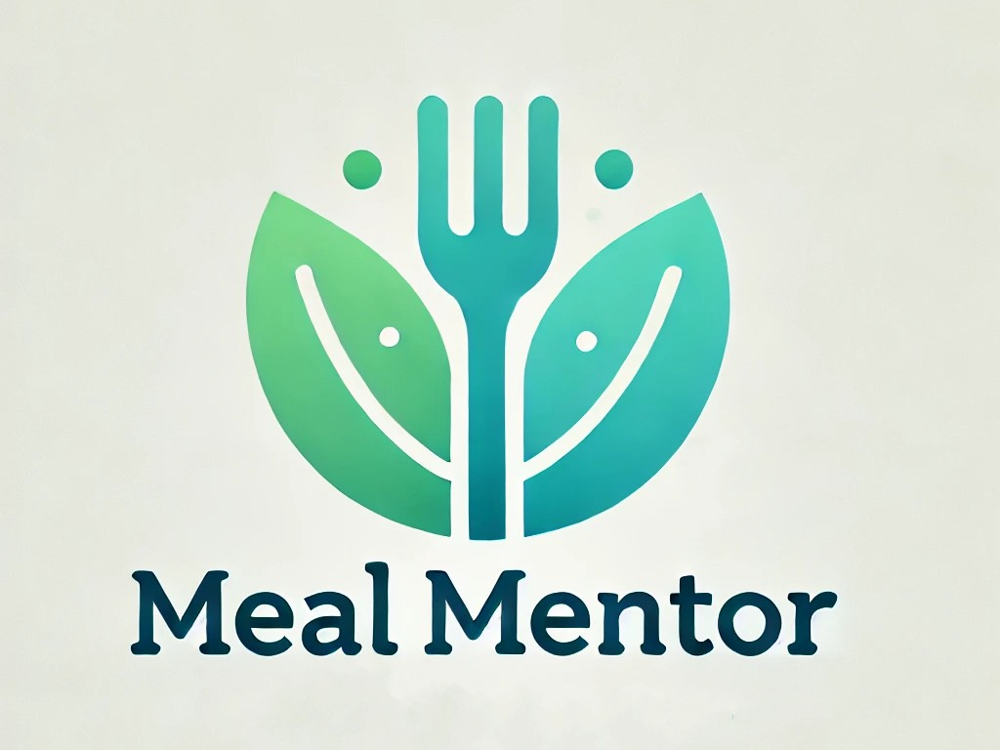

# Meal Mentor 🍽️

**Meal Mentor** is an intelligent recipe recommendation system designed to help users discover healthy and nutritious meals tailored to their dietary preferences and nutritional goals. By leveraging advanced technologies such as Retrieval-Augmented Generation (RAG) and Large Language Models (LLMs) from OpenAI, Meal Mentor provides personalized recipe suggestions based on diet types and specific nutritional values.

<p align="center">
  
</p>

## Table of Contents

- [Introduction](#introduction)
- [Problem Description](#problem-description)
- [Project Overview](#project-overview)
- [Features](#features)
- [Technologies Used](#technologies-used)
- [System Architecture](#system-architecture)
- [Setup and Installation](#setup-and-installation)
- [Usage](#usage)
- [Evaluation](#evaluation)
  - [Retrieval Evaluation](#retrieval-evaluation)
  - [RAG Evaluation](#rag-evaluation)
- [Monitoring and Feedback](#monitoring-and-feedback)
- [Ingestion Pipeline](#ingestion-pipeline)
- [Interface](#interface)
- [Containerization](#containerization)
- [Reproducibility](#reproducibility)
- [Best Practices](#best-practices)
- [Future Enhancements](#future-enhancements)
- [Acknowledgments](#acknowledgments)
- [License](#license)

---

## Introduction

In today's fast-paced world, maintaining a healthy diet can be challenging. With an overwhelming number of recipes and dietary information available, finding meals that meet individual nutritional needs and preferences is time-consuming and often frustrating. Meal Mentor aims to simplify this process by providing personalized recipe recommendations based on users' dietary requirements and nutritional goals.

## Problem Description

Many individuals struggle to plan meals that align with their dietary preferences, nutritional goals, and health requirements. Whether someone is following a specific diet like keto, vegan, or Mediterranean, or trying to manage macronutrient intake (e.g., high protein, low carb), finding suitable recipes can be a daunting task.

Existing recipe platforms often lack the ability to provide personalized recommendations that consider both dietary restrictions and specific nutritional values. Users are left to manually sift through countless recipes, which is inefficient and discouraging.

**Meal Mentor** addresses this problem by leveraging advanced technologies to deliver tailored recipe suggestions, enhancing the user experience and promoting healthier eating habits.

## Project Overview

Meal Mentor is an end-to-end application that combines a knowledge base of recipes with powerful search and AI capabilities to provide users with customized meal recommendations. The application uses:

- **Retrieval-Augmented Generation (RAG)**: Integrates information retrieval and natural language generation to produce relevant and context-aware responses.
- **OpenAI API**: Utilizes LLMs to interpret user queries and generate personalized recommendations.
- **Elasticsearch**: Implements advanced search functionalities to efficiently retrieve relevant recipes from the knowledge base.
- **FastAPI**: Serves as the backend framework to manage API endpoints and handle user requests.
- **JavaScript and HTML Frontend**: Provides an intuitive and responsive user interface.
- **PostgreSQL**: Stores structured data, including recipes, user preferences, and feedback.
- **Grafana**: Monitors system performance, user interactions, and feedback for continuous improvement.

## Features

1. **Personalized Recipe Recommendations**: Suggests recipes based on diet type (e.g., keto, vegan, Mediterranean) and specific nutritional values.
2. **Nutritional Filtering**: Allows users to set macronutrient ranges (e.g., minimum protein, maximum carbs).
3. **Ingredient Inclusion/Exclusion**: Users can specify ingredients to include or exclude in their recommendations.
4. **User Feedback Collection**: Enables users to provide feedback on recommendations to improve the system.
5. **Real-Time Monitoring**: Tracks user interactions and system performance through Grafana dashboards.
6. **Conversational Interface**: Supports natural language queries for an enhanced user experience.

## Technologies Used

- **FastAPI**: High-performance web framework for building APIs with Python 3.11.
- **OpenAI API**: Accesses advanced LLMs for natural language understanding and generation.
- **Elasticsearch**: Provides robust full-text search and analytics engine for efficient data retrieval.
- **PostgreSQL**: Relational database system for storing structured data.
- **Grafana**: Open-source platform for monitoring and observability.
- **JavaScript and HTML**: Frontend technologies for building a responsive user interface.
- **Docker and Docker Compose**: Containerization tools for deploying and managing application services.
- **Prometheus**: Monitoring system and time-series database (if used).
- **Python Libraries**: Including `pandas`, `requests`, `asyncio`, `uvicorn`, `sqlalchemy`, `elasticsearch-py`, etc.

## System Architecture

The Meal Mentor application consists of the following components:

- **Frontend**: A JavaScript and HTML-based user interface that allows users to input their dietary preferences and view recipe recommendations.
- **Backend (FastAPI)**: Handles API requests from the frontend, processes user queries, and communicates with other services.
- **Knowledge Base (Elasticsearch)**: Stores and indexes the recipe data, allowing for efficient search and retrieval.
- **Database (PostgreSQL)**: Stores user data, feedback, and monitoring logs.
- **LLM Integration (OpenAI API)**: Processes user queries using LLMs to understand intent and generate personalized responses.
- **Monitoring (Grafana)**: Collects and visualizes metrics on system performance and user interactions.

### Architecture Diagram

*(Insert a system architecture diagram here, if available)*

## Setup and Installation

### Prerequisites

- **Python 3.11**
- **Docker** and **Docker Compose**
- **OpenAI API Key**: Sign up at [OpenAI](https://openai.com/) to obtain an API key.
- **Elasticsearch**: Docker image will be used.
- **PostgreSQL**: Docker image will be used.
- **Node.js and npm** (if building the frontend from source)

### Environment Configuration

1. **Clone the Repository**

   ```bash
   git clone https://github.com/yourusername/meal-mentor.git
   cd meal-mentor
   ```

2. **Set Up Environment Variables**

   Create a `.env` file in the project root directory and include the following variables:

   ```env
   OPENAI_API_KEY=your_openai_api_key
   ELASTICSEARCH_HOST=elasticsearch
   ELASTICSEARCH_PORT=9200
   POSTGRES_USER=your_postgres_user
   POSTGRES_PASSWORD=your_postgres_password
   POSTGRES_DB=meal_mentor_db
   ```

3. **Install Python Dependencies**

   Create and activate a virtual environment:

   ```bash
   python3.11 -m venv venv
   source venv/bin/activate
   ```

   Install required packages:

   ```bash
   pip install -r requirements.txt
   ```

4. **Build and Run Services with Docker Compose**

   Build and start the Docker containers:

   ```bash
   docker-compose up --build
   ```

   This will start the following services:

   - FastAPI application
   - Elasticsearch
   - PostgreSQL
   - Grafana (if configured)

5. **Initialize the Database and Elasticsearch Index**

   Run the ingestion script to populate the database and Elasticsearch index with recipe data:

   ```bash
   python ingest_data.py
   ```

   *Note: Ensure that the Docker containers are running before executing the script.*

## Usage

### Access the Application

Open your web browser and navigate to `http://localhost:8000` to access the Meal Mentor frontend interface.

### Using the API

You can interact with the API directly using tools like `curl` or `Postman`.

**Example: Get Recipe Recommendations**

```bash
curl -X POST "http://localhost:8000/recommendations"      -H "Content-Type: application/json"      -d '{
           "diet_type": "keto",
           "min_protein": 20,
           "max_carbs": 10,
           "include_ingredients": ["chicken", "spinach"],
           "exclude_ingredients": ["nuts"]
         }'
```

**Example Response:**

```json
{
  "recipes": [
    {
      "title": "Grilled Chicken with Spinach",
      "ingredients": ["chicken breast", "spinach", "olive oil", "garlic"],
      "instructions": "Season the chicken breast with salt and pepper...",
      "nutrition": {
        "calories": 350,
        "protein": 30,
        "carbs": 8,
        "fat": 20
      }
    }
  ]
}
```

### Frontend Usage

1. **Input Preferences**: Use the interface to select your diet type, set nutritional filters, and specify ingredients to include or exclude.

2. **Get Recommendations**: Click the "Get Recipes" button to receive personalized recipe suggestions.

3. **Provide Feedback**: After trying a recipe, you can submit feedback to help improve the recommendations.

### Monitoring

Access the Grafana dashboard at `http://localhost:3000` to view system metrics and user interaction data.

## Evaluation

### Retrieval Evaluation

To ensure that the most relevant recipes are retrieved based on user queries, multiple retrieval approaches were evaluated:

- **Baseline Retrieval**: Used standard Elasticsearch full-text search without boosting.
- **Improved Retrieval with Boosting**: Adjusted Elasticsearch query to boost fields like diet type, ingredients, and nutritional values.

**Evaluation Metrics:**

- **Hit Rate**: Percentage of queries where relevant recipes were retrieved.
- **Mean Reciprocal Rank (MRR)**: Measures how early the relevant recipe appears in the search results.

### RAG Evaluation

Different RAG approaches were tested to optimize the integration between the knowledge base and the LLM:

- **Approach 1**: Simple concatenation of retrieved recipes in the prompt.
- **Approach 2**: Summarizing retrieved recipes before inclusion in the prompt.
- **Approach 3**: Using a template to structure the prompt with key information.

## Monitoring and Feedback

Meal Mentor collects user feedback and monitors system performance to continuously improve the application.

### Grafana Dashboard

The Grafana dashboard displays:

- **User Interactions**: Number of queries, feedback submissions, and active users.
- **System Performance**: API response times, error rates, and resource utilization.
- **Feedback Analysis**: User satisfaction rates and common issues reported.

**Dashboard Metrics Include:**

1. **Total Queries**: Tracks the number of recipe recommendation requests.
2. **Average Response Time**: Monitors the performance of the API.
3. **User Feedback Scores**: Visualizes satisfaction ratings over time.
4. **Error Rates**: Identifies any issues in the system for prompt resolution.
5. **Popular Diet Types**: Shows which diet types are most requested by users.

### Feedback Mechanism

Users can rate the relevance of the recommendations and provide comments. This data is stored in PostgreSQL and used to refine the recommendation algorithms.

## Ingestion Pipeline

An automated ingestion pipeline was implemented to process and index recipe data into the knowledge base.

### Steps:

1. **Data Collection**: Recipes were sourced from open datasets and APIs.
2. **Data Cleaning and Transformation**: Ensured consistency in data formats and fields.
3. **Indexing**: Recipes were indexed into Elasticsearch with appropriate mappings.
4. **Database Population**: Recipe metadata and user-related data were stored in PostgreSQL.

### Tools Used:

- **Python Scripts**: Automated data processing tasks.
- **Asyncio**: For asynchronous data fetching and processing.
- **Elasticsearch Bulk API**: For efficient indexing of large datasets.
- **Airflow or Prefect (if used)**: For scheduling and managing ingestion workflows.

## Interface

Meal Mentor provides both a user-friendly web interface and a RESTful API.

### Web Interface

- Built with HTML, CSS, and JavaScript.
- Responsive design for compatibility with various devices.
- Features intuitive forms for inputting preferences and viewing recommendations.
- Supports natural language queries in addition to structured inputs.

## Containerization

The entire application is containerized using Docker and orchestrated with Docker Compose.

## Reproducibility

To ensure that others can reproduce the results and run the application:

- **Clear Instructions**: Provided detailed setup and usage instructions.
- **Dependency Management**: All dependencies are specified in `requirements.txt`.
- **Version Control**: Specific versions of packages are used to avoid compatibility issues.
- **Sample Data**: Included sample datasets or scripts to download necessary data.

## Best Practices

- **Hybrid Search**: Combined text search and vector search (if applicable) to improve retrieval accuracy.
- **Document Re-ranking**: Implemented custom scoring in Elasticsearch to prioritize more relevant recipes.
- **Prompt Engineering**: Designed prompts to optimize LLM responses, ensuring clarity and relevance.
- **User Query Rewriting**: Preprocessed user queries to improve search results (e.g., synonym expansion, spelling correction).
- **Error Handling**: Implemented robust error handling in the backend.
- **Asynchronous Processing**: Used `asyncio` for non-blocking operations.
- **Security**: Ensured secure handling of API keys and user data.
- **Logging**: Implemented comprehensive logging for easier debugging and monitoring.

## Future Enhancements

1. **Advanced Nutritional Analysis**: Incorporate micronutrient considerations and dietary restrictions (e.g., allergies).
2. **User Accounts**: Allow users to create profiles to save preferences and history.
3. **Machine Learning Models**: Develop recommendation algorithms based on user behavior and feedback.
4. **Integration with Wearables**: Sync with fitness trackers to tailor recommendations based on activity levels.
5. **Mobile Application**: Develop native apps for iOS and Android platforms.
6. **Multi-Language Support**: Extend the application to support multiple languages.
7. **Social Features**: Enable users to share recipes and recommendations with friends.

## Acknowledgments

- **OpenAI**: For providing the powerful language models used in the application.
- **Elasticsearch**: For the robust search capabilities.
- **FastAPI**: For the high-performance web framework.
- **Grafana**: For the excellent monitoring tools.
- **Community Contributors**: Everyone who contributed to datasets and open-source libraries.
- **Recipe Data Sources**: Open recipe databases and APIs that provided the data for the knowledge base.

## License

This project is licensed under the MIT License.

---

**Enjoy discovering healthy meals with Meal Mentor!**

---