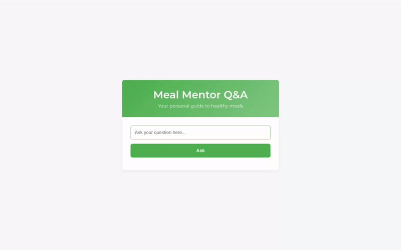
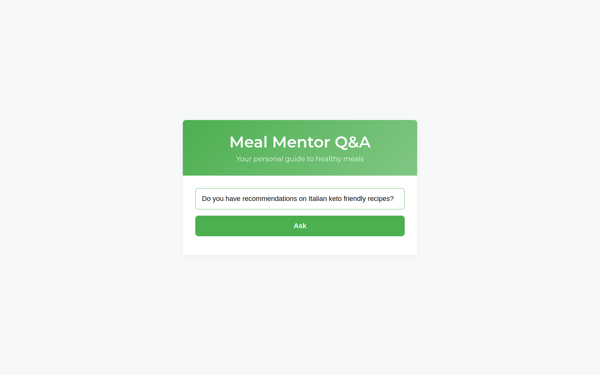
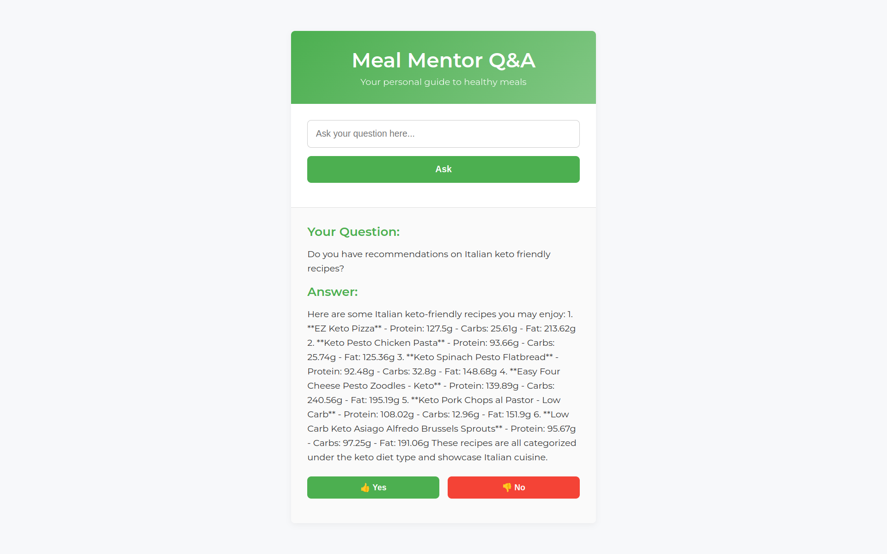
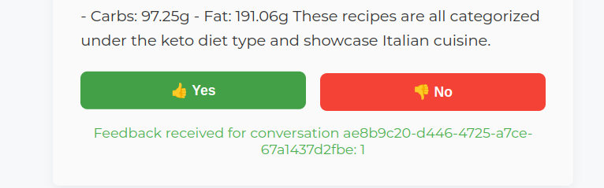
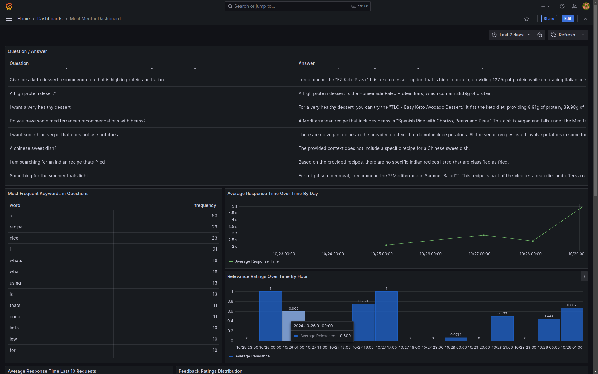
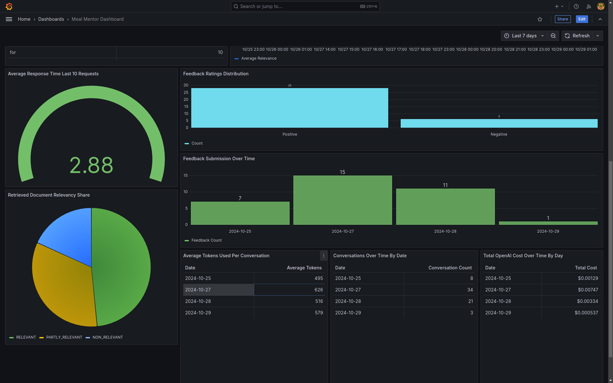

# Meal Mentor

**Meal Mentor** is an intelligent recipe recommendation system designed to help users discover healthy and nutritious
meals tailored to their dietary preferences and nutritional goals. Leveraging advanced technologies like
Retrieval-Augmented Generation (RAG) and Large Language Models (LLMs) from OpenAI, Meal Mentor provides personalized
recipe suggestions based on diet types and specific nutritional values.

<p align="center">
  
</p>

## Table of Contents

- [Introduction](#introduction)
- [Problem Description](#problem-description)
- [Quick Application Demo](#quick-application-demo)
- [Project Overview](#project-overview)
- [Features](#features)
- [Technologies Used](#technologies-used)
- [System Architecture](#system-architecture)
    - [Dataset: Healthy Diet Recipes](#dataset-healthy-diet-recipes)
- [Setup and Installation](#setup-and-installation)
    - [Prerequisites](#prerequisites)
    - [Installation Steps](#installation-steps)
- [Usage](#usage)
    - [API Example](#api-example)
    - [Example Response](#example-response)
- [Code Structure](#code-structure)
- [Evaluation](#evaluation)
    - [RAG Evaluation](#rag-evaluation)
    - [Retrieval Evaluation](#retrieval-evaluation)
- [Monitoring and Feedback](#monitoring-and-feedback)
    - [Grafana Dashboard](#grafana-dashboard)
    - [Feedback Mechanism](#feedback-mechanism)
- [Ingestion Pipeline](#ingestion-pipeline)
    - [Ingestion Steps](#ingestion-steps)
- [Interface](#interface)
    - [Web Interface](#web-interface)
- [Containerization](#containerization)
- [Future Enhancements](#future-enhancements)
- [Acknowledgments](#acknowledgments)
- [License](#license)

---

## Introduction

In today's fast-paced world, maintaining a healthy diet can be challenging. With an overwhelming number of recipes and
dietary information available, finding meals that meet individual nutritional needs and preferences is time-consuming
and often frustrating. Meal Mentor aims to simplify this process by providing personalized recipe recommendations based
on users' dietary requirements and nutritional goals.

## Problem Description

Many individuals struggle to plan meals that align with their dietary preferences, nutritional goals, and health
requirements. Whether someone is following a specific diet like keto, vegan, or Mediterranean, or trying to manage
macronutrient intake (e.g., high protein, low carb), finding suitable recipes can be a daunting task.

Existing recipe platforms often lack the ability to provide personalized recommendations that consider both dietary
restrictions and specific nutritional values. Users are left to manually sift through countless recipes, which is
inefficient and discouraging.

**Meal Mentor** addresses this problem by leveraging advanced technologies to deliver tailored recipe suggestions,
enhancing the user experience and promoting healthier eating habits.

## Quick Application Demo



## Project Overview

Meal Mentor is an end-to-end application that combines a knowledge base of recipes with powerful search and AI
capabilities to provide customized meal recommendations. The application utilizes:

- **Retrieval-Augmented Generation (RAG)**
- **OpenAI API**
- **MinSearch**
- **FastAPI**
- **JavaScript and HTML Frontend**
- **PostgreSQL**
- **Grafana**

## Features

- **Personalized Recipe Recommendations**: Suggests recipes based on diet type and specific nutritional values.
- **User Feedback Collection**: Allows users to provide feedback to improve recommendations.
- **Real-Time Monitoring**: Tracks user interactions and system performance.
- **Conversational Interface**: Supports natural language queries for an enhanced user experience.
- **Complete Containerization with Docker Compose**: Ensures easy deployment and scalability.
- **Automated Ingestion Pipeline**: Indexes recipe data for efficient search and retrieval automatically when the
  application starts.

## Technologies Used

- **Python 3.11**: Programming language used for backend development.
- **FastAPI**: High-performance web framework for building APIs with Python.
- **OpenAI API**: Accesses advanced LLMs for natural language understanding and generation.
- **MinSearch**: An in-memory search engine for indexing and retrieving recipe data.
- **PostgreSQL**: Relational database system for storing structured data.
- **Grafana**: Open-source platform for monitoring and observability.
- **JavaScript and HTML**: Frontend technologies for building a responsive user interface.
- **Docker and Docker Compose**: Containerization tools for deploying and managing application services.

## System Architecture

The Meal Mentor application consists of:

- **Frontend**: A user interface for inputting preferences and viewing recommendations.
- **Backend (FastAPI)**: Handles API requests and processes user queries.
- **Knowledge Base (MinSearch)**: Indexes recipe data for efficient search and retrieval.
- **Database (PostgreSQL)**: Stores user data, feedback, and logs.
- **LLM Integration (OpenAI API)**: Processes queries to generate personalized responses.
- **Monitoring (Grafana)**: Visualizes system performance and user interactions.
- **Ingestion Pipeline**: Automates data processing and indexing for recipe recommendations with an automatic ingestion
  script when the app is started.
- **Feedback Mechanism**: Collects user ratings and comments to improve recommendations.

### Dataset: Healthy Diet Recipes

This project utilizes
the [Healthy Diet Recipes](https://www.kaggle.com/datasets/thedevastator/healthy-diet-recipes-a-comprehensive-dataset)
dataset from Kaggle, offering a wide range of recipes tailored for various diets and cuisines, with a focus on healthy,
nutritious meal options. The original dataset included information on extraction day and time, which has been removed as
it was not essential. The data has also been cleaned to remove duplicates, resulting in a streamlined version optimized
for efficient use with language models.

#### Dataset Details:

- **Total Entries**: 7,805 unique recipes.
- **Subset for Application**: To reduce LLM calls and simplify usage, a random sample of 200 recipes was selected from
  the full dataset.

#### Columns:

- **Diet_type**: Specifies the type of diet each recipe supports (e.g., vegan, keto).
- **Recipe_name**: The name or title of the recipe.
- **Cuisine_type**: Indicates the cuisine the recipe is associated with (e.g., Mediterranean, Indian).
- **Protein(g)**: The amount of protein per recipe in grams.
- **Carbs(g)**: The amount of carbohydrates per recipe in grams.
- **Fat(g)**: The amount of fat per recipe in grams.

This refined dataset supports designing diet-specific meal plans, examining nutrient distributions, and exploring
healthy recipes across various dietary preferences and cuisines.

You can find the dataset under `data/data.csv`.

## Setup and Installation

### Prerequisites

- **Python 3.11**
- **Docker and Docker Compose**
- **OpenAI API Key**
- **PostgreSQL** (Docker image)
- **Grafana** (Docker image)

### Installation Steps

1. **Clone the Repository**

   ```bash
   git clone https://github.com/liminm/meal-mentor.git
   cd meal-mentor
   ```

2. **Copy the Template**

   Duplicate the `.env.template` file and rename the copy to `.env`:

   ```bash
   cp .env.template .env
   ```

3. **Set Up Environment Variables**

   Open the `.env` file in your preferred text editor and replace the placeholder values with your actual configuration
   details.

   It is required to set the `OPENAI_API_KEY` in the `.env` file. The other variables are optional and have default
   values.

   **Note:** If you want to run the FastAPI backend locally, you need to set `POSTGRES_HOST=localhost` in the `.env`
   file.

   **Ensure that your `.env` file is not committed to version control by adding it to your `.gitignore` file:**

   ```gitignore
   # .gitignore
   .env
   ```

4. **Install Python Dependencies**

   For dependency management, we use pipenv, so you need to install it:

   ```bash
   pip install pipenv
   ```

   Once installed, you can install the app dependencies:

   ```bash
   pipenv install --dev
   ```

5. **Initialize the Database**

   Before the application starts for the first time, the database needs to be initialized.

   Start the PostgreSQL container:

   ```bash
   docker-compose up postgres
   ```

   Then, in a new terminal window, run the following commands:

   ```bash
   pipenv shell
   cd meal_mentor
   export POSTGRES_HOST=localhost
   python db_prep.py
   ```

   *Ensure the PostgreSQL Docker container is running before executing the script.*

6. **Build and Run Services with Docker Compose**

   **Important:** Ensure that `POSTGRES_HOST=postgres` in the `.env` file when running with Docker Compose.

   ```bash
   docker-compose up --build
   ```

   This starts the FastAPI application, PostgreSQL, and Grafana.

7. **Alternatively, Run the FastAPI Application Locally**

   First, change the `POSTGRES_HOST` in the `.env` file to `localhost`:

   ```env
   POSTGRES_HOST=localhost
   ```

   Start only PostgreSQL and Grafana:

   ```bash
   docker-compose up postgres grafana
   ```

   Then run the FastAPI application in your terminal:

   ```bash
   pipenv run python -m uvicorn meal_mentor.app:app --reload
   ```

## Usage

Access the application at `http://localhost:8000`. You will be greeted with a web interface where you can input your
questions and receive personalized recipe recommendations based on your dietary preferences and nutritional goals.
Additionally you can provide feedback on the recommendations to help improve the system.

<p align="center">
  
  
  
</p>

To access Grafana, visit `http://localhost:3000` and log in with the default credentials unless changed in the `.env`
file (username: `admin`, password: `admin`).

The Grafana `dashboard.json` file is located in the `grafana` folder in the repo. You can import it into Grafana to
visualize the application's performance and user interactions. For further info on how to setup Grafana, refer to the
[Setting up Grafana](#setting-up-grafana) section.

<p align="center">
  
  
</p>

To check the content of the database, use `pgcli` (already installed with pipenv):

```bash
pipenv run pgcli -h localhost -U your_username -d meal_mentor -W
```

### API Example

```bash
curl -X POST "http://localhost:8000/api/question" \
     -H "Content-Type: application/json" \
     -d '{
           "question": "What is a nice healthy Italian recipe?"
         }'
```

### Example Response

```json
{
  "conversation_id": "71aea2ea-ad95-4e47-b050-cbce07729faf",
  "question": "What is a nice healthy Italian recipe?",
  "answer": "A nice healthy Italian recipe is the Italian Tomato Tart, which is part of the DASH diet. It has 70.67g of protein, 300.07g of carbs, and 63.38g of fat."
}
```

## Code Structure

The code for the application is in the [`meal_mentor`](meal_mentor/) folder:

- [`app.py`](meal_mentor/app.py) - The FastAPI application, the main entry point to the application.
- [`rag.py`](meal_mentor/rag.py) - The main RAG logic for retrieving data and building the prompt.
- [`ingest.py`](meal_mentor/ingest.py) - Loads the data into the knowledge base.
- [`minsearch.py`](meal_mentor/minsearch.py) - An in-memory search engine.
- [`db.py`](meal_mentor/db.py) - The logic for logging the requests and responses to PostgreSQL.
- [`db_prep.py`](meal_mentor/db_prep.py) - The script for initializing the database.

The frontend code is in the [`static`](static/) folder:

- [`index.html`](static/index.html) - The main HTML and JavaScript file with the frontend code.

The notebooks used for evaluation and data processing are in the [`notebooks`](notebooks/) folder:

- [`rag_evaluation.ipynb`](notebooks/rag_evaluation.ipynb) - Notebook for evaluating the RAG models.
- [`prepare_dataset.ipynb`](notebooks/prepare_dataset.ipynb) - Notebook for processing and cleaning the dataset.
- [`retrieval_evaluation_minsearch.ipynb`](notebooks/retrieval_evaluation_minsearch.ipynb) - Notebook for evaluating the
  retrieval model with MinSearch.
- [`retrieval_evaluation_elasticsearch.ipynb`](notebooks/retrieval_evaluation_elasticsearch.ipynb) - Notebook for
  evaluating the retrieval model with Elasticsearch.

The data used for the application is in the [`data`](data/) folder:

- [`data.csv`](data/data.csv) - The dataset used for the application.
- [`All_Diets.csv`](data/All_Diets.csv) - The original dataset.
- [`ground-truth-retrieval_4o_mini.csv`](data/ground-truth-retrieval_4o_mini.csv) - Ground truth data used for
  evaluation.
- [`ground-truth-retrieval_4o.csv`](data/ground-truth-retrieval_4o.csv) - Ground truth data used for evaluation.
- [`rag-eval-gpt-4o-mini.csv`](data/rag-eval-gpt-4o-mini.csv) - RAG evaluation data.
- [`rag-eval-gpt-4o.csv`](data/rag-eval-gpt-4o.csv) - RAG evaluation data.

The Grafana dashboard configuration is in the [`grafana`](grafana/) folder:

- [`dashboard.json`](grafana/dashboard.json) - The Grafana dashboard configuration.

## Evaluation

### RAG Evaluation

Two RAG approaches were tested to optimize the integration between the knowledge base and the LLM:

#### **Approach 1**: LLM-as-a-Judge Metric on `gpt-4o-mini`

| Relevance       | Count | Proportion |
|-----------------|-------|------------|
| RELEVANT        | 151   | 0.755      |
| PARTLY_RELEVANT | 29    | 0.145      |
| NON_RELEVANT    | 20    | 0.100      |

#### **Approach 2**: LLM-as-a-Judge Metric on `gpt-4o`

| Relevance       | Count | Proportion |
|-----------------|-------|------------|
| RELEVANT        | 95    | 0.475      |
| PARTLY_RELEVANT | 76    | 0.380      |
| NON_RELEVANT    | 29    | 0.145      |

The notebook for this evaluation is located at [`notebooks/rag_evaluation.ipynb`](notebooks/rag_evaluation.ipynb), and
the ground truth data used can be found in [
`data/ground-truth-retrieval_4o_mini.csv`](data/ground-truth-retrieval_4o_mini.csv).

**Insight**: Based on these results, **gpt-4o-mini** was chosen due to its higher proportion of fully relevant
responses.

### Retrieval Evaluation

Two retrieval models were each evaluated on two different datasets generated by `gpt-4o` and `gpt-4o-mini` to determine
the optimal approach for indexing and searching the recipe data. Additionally another evaluation was performed on optimized parameters for MinSearch on the two types of ground truth datasets.
Making for 6 different evaluations:

#### **MinSearch Evaluation**

For the `gpt-4o-mini` ground truth dataset:

| Metric   | Value  |
|----------|--------|
| Hit Rate | 0.898  |
| MRR      | 0.8579 |

With optimized parameters:

| Metric   | Value |
|----------|-------|
| Hit Rate | 0.898 |
| MRR      | 0.85ß |

For the `gpt-4o` ground truth dataset:

| Metric   | Value  |
|----------|--------|
| Hit Rate | 0.947  |
| MRR      | 0.9230 |

With optimized parameters:

| Metric   | Value |
|----------|-------|
| Hit Rate | 0.947 |
| MRR      | 0.92  |

#### **Elasticsearch Evaluation**

For the `gpt-4o-mini` ground truth dataset:

| Metric   | Value  |
|----------|--------|
| Hit Rate | 0.929  |
| MRR      | 0.9035 |

For the `gpt-4o` ground truth dataset:

| Metric   | Value  |
|----------|--------|
| Hit Rate | 0.974  |
| MRR      | 0.9507 |

**Conclusion**: Both MinSearch and Elasticsearch performed well, but MinSearch was chosen for its simplicity and ease of
integration.

## Monitoring and Feedback

Meal Mentor collects user feedback and monitors system performance using Grafana dashboards.

### Grafana Dashboard

The Grafana dashboard provides comprehensive insights into the application's performance, user interactions, and
resource utilization. The dashboard includes the following panels:

1. **Question / Answer** (Table)
2. **Most Frequent Keywords in Questions** (Table)
3. **Average Response Time Over Time by Day** (Time Series)
4. **Relevance Ratings Over Time by Hour** (Bar Chart)
5. **Average Response Time Last 10 Requests** (Gauge)
6. **Feedback Ratings Distribution** (Bar Chart)
7. **Feedback Submission Over Time** (Bar Chart)
8. **Retrieved Document Relevancy Share** (Pie Chart)
9. **Conversations Over Time by Date** (Table)
10. **Total OpenAI Cost Over Time by Day** (Table)
11. **Average Tokens Used per Conversation** (Table)

These panels help in monitoring the performance, quality, and cost-efficiency of the Meal Mentor application, aiming to
optimize user engagement and experience.

### Setting up Grafana

All Grafana configurations are in the [`grafana`](grafana/) folder:

- [`init.py`](grafana/init.py) - for initializing the datasource and the dashboard.
- [`dashboard.json`](grafana/dashboard.json) - the actual dashboard (taken from LLM Zoomcamp without changes).

To initialize the dashboard, first ensure Grafana is
running (it starts automatically when you do `docker-compose up`).

Then run:

```bash
pipenv shell

cd grafana

# make sure the POSTGRES_HOST variable is not overwritten 
env | grep POSTGRES_HOST

python init.py
```

Then go to [localhost:3000](http://localhost:3000):

- Login: "admin"
- Password: "admin"

When prompted, keep "admin" as the new password.

### Feedback Mechanism

Users can rate the relevance of the recommendations and provide comments. This data is stored in PostgreSQL and used to
refine the recommendation algorithms.

## Ingestion Pipeline

An automated ingestion pipeline was implemented to process and index recipe data into the knowledge base.

### Ingestion Steps

1. **Data Collection**: Recipes were sourced from an open dataset.
2. **Data Cleaning and Transformation**: Ensured consistency in data formats and fields, such as removing duplicates and
   standardizing units.
3. **Indexing**: Recipes are indexed and retrieved using MinSearch.

## Interface

### Web Interface

- Built with HTML, CSS, and JavaScript for a responsive user experience.
- Supports natural language and structured queries.
- Enables question submission via Enter key or a button.
- Includes a feedback feature for rating recommendations.
- Displays recipes with detailed information and nutritional values.

## Containerization

The application is containerized using Docker and orchestrated with Docker Compose for easy deployment.

## Future Enhancements

- **Advanced Nutritional Analysis**
- **User Accounts and Profiles**
- **Social Sharing Features**
- **Further Improvements to the RAG Model**
- **Cloud Deployment and Scalability**

## Acknowledgments

This project was developed as part of the **LLM Zoomcamp** program. Special thanks to **Alexey Grigorev**, the *
*DataTalks team**, and the community for their invaluable support.

## License

This project is licensed under the MIT License.

---

**Enjoy discovering healthy meals with Meal Mentor!**

---